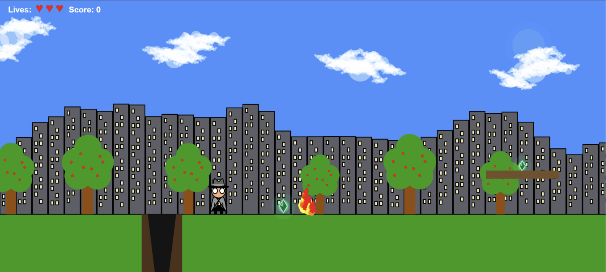
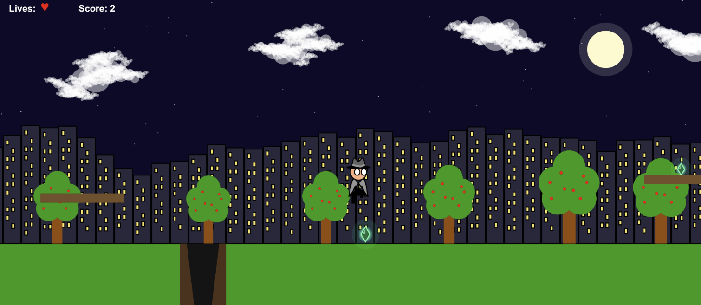
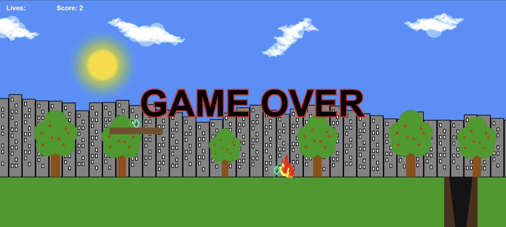

# JavaScript p5.js 2D Side-Scrolling Game

A 2D side-scrolling game developed using JavaScript and the p5.js library.

This project was developed between April and September 2026 as part of my BSc Computer Science studies. It involved building the game mechanics, visual environment and interaction logic using JavaScript.

## Game Features

- Side-scrolling game world with camera movement
- Character walking and jumping states
- Platform mechanics and collision detection
- Moving enemies with collision handling
- Collectable items and scoring system
- Lives, game-over and level-completion states
- Dynamic day-to-night environment
- Animated sun, moon and stars
- Sound effects and background audio
- Procedurally generated environmental elements

## JavaScript Concepts Used

The project gave me practical experience using:

- Functions and conditional logic
- Arrays and arrays of objects
- Loops and nested iteration
- Constructor functions
- Factory functions
- Object properties and methods
- Collision detection
- Recursion
- State management
- Coordinate systems and transformations
- Debugging and iterative testing

## Selected Technical Examples

### Enemy Movement

Enemies are created with individual positions, speeds and movement ranges. Their direction is reversed when they reach the boundary of their movement range.

```javascript
function Enemy(x, y, speed, range) {
    this.x = x;
    this.startX = x;
    this.y = y;
    this.speed = speed;
    this.range = range;

    this.update = function() {
        this.x += this.speed;

        if (this.x > this.startX + this.range ||
            this.x < this.startX - this.range) {
            this.speed *= -1;
        }
    };
}
```

### Recursive Visual Effects

Recursion is used to generate visual effects within the game, including the enemy flame graphics.

```javascript
function flameRecursion(x, y, scale) {
    if (scale < 5 || y > floorPos_y + 8) {
        return;
    }

    let green = map(scale, 10, 20, 10, 255);
    fill(255, green, 0, 300);
    ellipse(x, y, scale);

    flameRecursion(
        x + random(-scale / 6, scale / 2),
        y + scale / 4,
        scale * 0.80
    );

    flameRecursion(
        x + random(-scale / 4, scale / 2),
        y - scale / 2,
        scale * 0.70
    );
}
```

## Screenshots

### Daytime Gameplay



### Night-Time Gameplay



### Game Over



## Source Code

The complete source code is maintained in a private GitHub repository. Selected code is included above to demonstrate the implementation while protecting the full project.

Full source code can be made available for technical review during the recruitment process.
